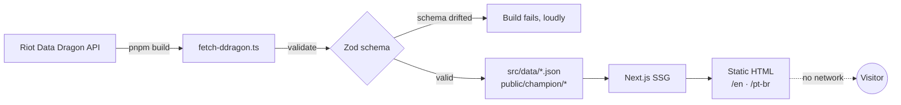

<div align="center">

# Mordekaiser

### *Death is not the end of ambition.*

A cinematic, fully static tribute to **Mordekaiser, the Iron Revenant** — built with Next.js 16, served in two languages, and rendered entirely at build time.

[](https://github.com/maneqg3/mordekaiser/actions/workflows/ci.yml)
[](https://nextjs.org)
[](https://www.typescriptlang.org)
[](#accessibility-is-a-test-not-a-promise)
[](#how-it-works)

**English** · [Português](./README.pt-br.md)

</div>

---

## What this is

A portfolio piece disguised as a shrine. Every champion name, ability description, cooldown and patch number on this page comes straight from **Riot's Data Dragon API** — but no visitor ever waits for that API, because it's fetched, validated and frozen into the page at build time.

The result is a site with no backend and no database: pre-rendered HTML that happens to know everything about Mordekaiser. The only server-side rule in the whole project is a redirect from `/` to `/en`.

> **Status:** Phase 1 — the skeleton. Routing, typography, colour system, data pipeline and quality gates are in place. The cinematic layer (WebGL, scroll-driven acts) lands in Phase 2. See the [roadmap](#roadmap).

## Highlights

| | |
|---|---|
| **Bilingual by design** | `/en` and `/pt-br` are separate pre-rendered pages, not a client-side language toggle. Each ships only its own text. |
| **Zero runtime API calls** | Riot's data is fetched once during `pnpm build`, validated against a schema, and written to disk. The live site never talks to Riot. |
| **Accessibility is a test** | Colour contrast is asserted by unit tests. Every page is scanned by axe-core in CI. A regression fails the build, not the user. |
| **A bundle budget with teeth** | CI measures the real gzipped JavaScript the browser downloads and **fails the build** past 145 kB. |
| **Self-hosted typography** | Four font families, subset and served from our own origin. No requests to Google, no layout shift, no third-party tracking. |
| **Four acts, one palette** | Colours are CSS `@property` custom properties that animate between four narrative acts — from the warm Wildlands to the black Realm of Death. |

## How it works

The interesting decision in this codebase is **when** the data is fetched.



If Riot changes the shape of their API, the **build** breaks — with an error naming the exact field that moved. Production never breaks, because production is just files. Nobody is paged at 3 a.m. because a champion gained a fifth ability.

Chromas are a good example of why the schema matters: Riot lists 57 Mordekaiser "skins", but 43 of them are colour variants that share a parent skin's splash art and return `403` if you request their own. The parser knows the difference.

## Accessibility is a test, not a promise

Every act's foreground/background pair is checked against the [WCAG 2.2 contrast formula](https://www.w3.org/WAI/WCAG22/Techniques/general/G17) by a unit test. The minimum for body text is **4.5:1**. These are the measured ratios:

| Act | Theme | Background | Foreground | Contrast |
|---|---|---|---|---|
| I | Wildlands | `#0f0e0c` | `#d6cfc0` | **12.44:1** |
| II | Grey Wastes | `#0c0e0e` | `#a8b4af` | **9.05:1** |
| III | The Forge | `#0a0b0b` | `#e8f2ec` | **17.21:1** |
| IV | Realm of Death | `#050807` | `#e8f2ec` | **17.57:1** |

On top of that, `axe-core` scans both locales on every push and the pipeline requires **zero violations**. Not "few". Zero.

## Quick start

**You'll need** [Node.js 22+](https://nodejs.org) and [pnpm](https://pnpm.io) (via `corepack enable`).

```bash
git clone https://github.com/maneqg3/mordekaiser.git
cd mordekaiser
corepack enable
pnpm install
pnpm build   # fetches Riot's data, then builds
pnpm start   # http://localhost:3000/en
```

For day-to-day work, `pnpm dev` is enough — but run `pnpm build` at least once first, so the champion data exists on disk.

> The first build downloads 14 splash arts and 5 ability icons from Riot's CDN into `public/champion/`. Subsequent builds skip the download. Force a refresh with `FORCE_DDRAGON=1 pnpm build` when a new patch ships.

## Scripts

| Command | What it does |
|---|---|
| `pnpm dev` | Development server with hot reload |
| `pnpm build` | Fetch Riot's data, then produce the static site |
| `pnpm start` | Serve the production build |
| `pnpm test` | Unit tests (Vitest) |
| `pnpm test:coverage` | Unit tests + coverage, fails under 80% |
| `pnpm e2e` | End-to-end tests + accessibility scan (Playwright + axe) |
| `pnpm check:bundle` | Measure the gzipped JS budget |
| `pnpm lint` · `pnpm typecheck` | ESLint · TypeScript, both in strict mode |
| `pnpm fetch:ddragon` | Re-fetch Riot's data on its own |

## Project layout

```
src/
├── app/
│   ├── [locale]/       # <html lang>, metadata, the page itself
│   └── fonts.ts        # four self-hosted families
├── i18n/
│   ├── routing.ts      # en · pt-br, no locale-detection middleware
│   └── messages/       # translated copy
├── lib/                # pure, fully tested: contrast math + Riot's schema
├── styles/
│   ├── tokens.css      # @property colour tokens, four acts
│   └── typography.css  # fluid clamp() scale
└── data/               # generated at build time, not committed

scripts/
├── fetch-ddragon.ts    # the only code that touches the network
└── check-bundle.mjs    # the budget enforcer

tests/
├── unit/               # Vitest
└── e2e/                # Playwright + axe-core
```

## Quality gates

Nothing merges unless all of it is green. Both jobs run on every push and pull request:

- **`quality`** — ESLint, `tsc --noEmit` in strict mode, and unit tests with a hard **80% coverage floor** on `src/lib/`.
- **`build-e2e`** — a real production build (including a live fetch from Riot), the bundle budget, then Playwright driving Chromium through both locales with an accessibility scan.

Current numbers: **16 unit tests**, **96% statement coverage**, **142 kB** of gzipped initial JavaScript, **0** accessibility violations.

## Roadmap

- [x] **Phase 0** — De-risking spike. Can a WebGL fluid simulation and a depth-mapped parallax coexist at 60 fps on a real iPhone? Yes — the exploratory code that proved it lives on the [`spike/fase-0`](https://github.com/maneqg3/mordekaiser/tree/spike/fase-0) branch, kept as a record of the experiment.
- [x] **Phase 1** — The skeleton. Routing, i18n, colour tokens, typography, the Data Dragon pipeline, and every quality gate above.
- [ ] **Phase 2** — The cinema. Scroll-driven narrative through the four acts, WebGL fluid, depth parallax, and the ability showcase.
- [ ] **Phase 3** — Polish. Motion refinement, reduced-motion parity, performance budgets under load.

Each phase was built from a written spec and an implementation plan before a line of code was touched. The exploratory groundwork survives on the [`spike/fase-0`](https://github.com/maneqg3/mordekaiser/tree/spike/fase-0) branch.

## Tech stack

**[Next.js 16](https://nextjs.org)** (App Router, SSG) · **[React 19](https://react.dev)** · **[TypeScript](https://www.typescriptlang.org)** (strict) · **[Tailwind CSS 4](https://tailwindcss.com)** · **[next-intl](https://next-intl.dev)** · **[Zod](https://zod.dev)** · **[Vitest](https://vitest.dev)** · **[Playwright](https://playwright.dev)** + **[axe-core](https://github.com/dequelabs/axe-core)** · **[pnpm](https://pnpm.io)** · **[Vercel](https://vercel.com)**

## Legal

Mordekaiser and League of Legends are creations of **Riot Games**. This unofficial fan project follows Riot Games' [Legal Jibber Jabber](https://www.riotgames.com/en/legal) policy. Riot Games does not endorse or sponsor this project.

Champion artwork, names, lore and ability descriptions are the property of Riot Games and are served here from their public [Data Dragon](https://developer.riotgames.com/docs/lol#data-dragon) CDN. The source code in this repository is released under the [MIT License](./LICENSE).
