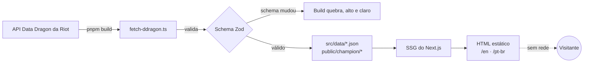

<div align="center">

# Mordekaiser

### *A morte não é o fim da ambição.*

Um tributo cinematográfico e totalmente estático a **Mordekaiser, o Revenã de Ferro** — feito com Next.js 16, servido em dois idiomas e renderizado inteiramente em tempo de build.

[](https://github.com/maneqg3/mordekaiser/actions/workflows/ci.yml)
[](https://nextjs.org)
[](https://www.typescriptlang.org)
[](#acessibilidade-é-teste-não-promessa)
[](#como-funciona)

[English](./README.md) · **Português**

</div>

---

## O que é isto

Uma peça de portfólio disfarçada de santuário. Cada nome de habilidade, descrição, tempo de recarga e número de patch nesta página vem direto da **API Data Dragon da Riot** — mas nenhum visitante espera por essa API, porque ela é consultada, validada e congelada na página durante o build.

O resultado é um site sem backend e sem banco de dados: HTML pré-renderizado que por acaso sabe tudo sobre Mordekaiser. A única regra que roda no servidor, no projeto inteiro, é um redirect de `/` para `/en`.

> **Status:** Fase 1 — o esqueleto. Rotas, tipografia, sistema de cores, pipeline de dados e portões de qualidade estão de pé. A camada cinematográfica (WebGL, atos guiados por scroll) chega na Fase 2. Veja o [roadmap](#roadmap).

## Destaques

| | |
|---|---|
| **Bilíngue por construção** | `/en` e `/pt-br` são páginas pré-renderizadas separadas, não um seletor de idioma no cliente. Cada uma carrega só o próprio texto. |
| **Zero chamadas de API em runtime** | Os dados da Riot são buscados uma vez, durante o `pnpm build`, validados contra um schema e gravados em disco. O site no ar nunca fala com a Riot. |
| **Acessibilidade é teste** | O contraste de cor é afirmado por testes unitários. Cada página é varrida pelo axe-core no CI. Uma regressão quebra o build, não o usuário. |
| **Orçamento de bundle com dentes** | O CI mede o JavaScript gzipado que o browser de fato baixa e **reprova o build** acima de 145 kB. |
| **Tipografia self-hosted** | Quatro famílias de fonte, com subset e servidas da nossa própria origem. Sem requisição ao Google, sem layout shift, sem rastreamento de terceiros. |
| **Quatro atos, uma paleta** | As cores são custom properties CSS `@property`, que animam entre quatro atos narrativos — das quentes Terras Selvagens ao negro Reino da Morte. |

## Como funciona

A decisão interessante deste código é **quando** os dados são buscados.



Se a Riot mudar o formato da API, o **build** quebra — com um erro nomeando exatamente o campo que se mexeu. A produção nunca quebra, porque produção são só arquivos. Ninguém é acordado às 3 da manhã porque um campeão ganhou uma quinta habilidade.

Os chromas são um bom exemplo de por que o schema importa: a Riot lista 57 "skins" de Mordekaiser, mas 43 delas são variantes de cor que compartilham a splash art de uma skin-mãe e devolvem `403` se você pedir a própria. O parser sabe a diferença.

## Acessibilidade é teste, não promessa

O par frente/fundo de cada ato é conferido contra a [fórmula de contraste da WCAG 2.2](https://www.w3.org/WAI/WCAG22/Techniques/general/G17) por um teste unitário. O mínimo para texto corrido é **4.5:1**. Estas são as razões medidas:

| Ato | Tema | Fundo | Frente | Contraste |
|---|---|---|---|---|
| I | Terras Selvagens | `#0f0e0c` | `#d6cfc0` | **12.44:1** |
| II | Descampado Cinzento | `#0c0e0e` | `#a8b4af` | **9.05:1** |
| III | A Forja | `#0a0b0b` | `#e8f2ec` | **17.21:1** |
| IV | Reino da Morte | `#050807` | `#e8f2ec` | **17.57:1** |

Além disso, o `axe-core` varre os dois idiomas a cada push, e o pipeline exige **zero violações**. Não "poucas". Zero.

## Começando

**Você precisa de** [Node.js 22+](https://nodejs.org) e [pnpm](https://pnpm.io) (via `corepack enable`).

```bash
git clone https://github.com/maneqg3/mordekaiser.git
cd mordekaiser
corepack enable
pnpm install
pnpm build   # busca os dados da Riot, depois compila
pnpm start   # http://localhost:3000/en
```

No dia a dia, `pnpm dev` basta — mas rode `pnpm build` ao menos uma vez antes, para que os dados do campeão existam em disco.

> O primeiro build baixa 14 splash arts e 5 ícones de habilidade do CDN da Riot para `public/champion/`. Builds seguintes pulam o download. Force a atualização com `FORCE_DDRAGON=1 pnpm build` quando sair um patch novo.

## Scripts

| Comando | O que faz |
|---|---|
| `pnpm dev` | Servidor de desenvolvimento com hot reload |
| `pnpm build` | Busca os dados da Riot e produz o site estático |
| `pnpm start` | Serve o build de produção |
| `pnpm test` | Testes unitários (Vitest) |
| `pnpm test:coverage` | Testes + cobertura, reprova abaixo de 80% |
| `pnpm e2e` | Testes ponta a ponta + varredura de acessibilidade (Playwright + axe) |
| `pnpm check:bundle` | Mede o orçamento de JS gzipado |
| `pnpm lint` · `pnpm typecheck` | ESLint · TypeScript, ambos em modo estrito |
| `pnpm fetch:ddragon` | Rebusca os dados da Riot isoladamente |

## Estrutura do projeto

```
src/
├── app/
│   ├── [locale]/       # <html lang>, metadata, a página em si
│   └── fonts.ts        # quatro famílias self-hosted
├── i18n/
│   ├── routing.ts      # en · pt-br, sem middleware de detecção de locale
│   └── messages/       # textos traduzidos
├── lib/                # puro e testado: matemática de contraste + schema da Riot
├── styles/
│   ├── tokens.css      # tokens de cor @property, quatro atos
│   └── typography.css  # escala fluida com clamp()
└── data/               # gerado no build, não versionado

scripts/
├── fetch-ddragon.ts    # o único código que toca a rede
└── check-bundle.mjs    # o fiscal do orçamento

tests/
├── unit/               # Vitest
└── e2e/                # Playwright + axe-core
```

## Portões de qualidade

Nada entra sem estar tudo verde. Os dois jobs rodam em cada push e cada pull request:

- **`quality`** — ESLint, `tsc --noEmit` em modo estrito e testes unitários com piso rígido de **80% de cobertura** em `src/lib/`.
- **`build-e2e`** — um build de produção de verdade (incluindo o fetch ao vivo na Riot), o orçamento de bundle, e então o Playwright dirigindo o Chromium pelos dois idiomas com varredura de acessibilidade.

Números atuais: **16 testes unitários**, **96% de cobertura de statements**, **142 kB** de JavaScript inicial gzipado, **0** violações de acessibilidade.

## Roadmap

- [x] **Fase 0** — Spike de derrisco. Uma simulação de fluido em WebGL e um parallax por depth map convivem a 60 fps num iPhone real? Convivem — o código exploratório que provou isso vive na branch [`spike/fase-0`](https://github.com/maneqg3/mordekaiser/tree/spike/fase-0), preservado como registro do experimento.
- [x] **Fase 1** — O esqueleto. Rotas, i18n, tokens de cor, tipografia, o pipeline do Data Dragon e todos os portões acima.
- [ ] **Fase 2** — O cinema. Narrativa guiada por scroll pelos quatro atos, fluido em WebGL, parallax de profundidade e a vitrine de habilidades.
- [ ] **Fase 3** — Polimento. Refino de movimento, paridade com `prefers-reduced-motion`, orçamentos de performance sob carga.

Cada fase nasceu de uma spec escrita e um plano de implementação antes de uma linha de código. O trabalho exploratório sobrevive na branch [`spike/fase-0`](https://github.com/maneqg3/mordekaiser/tree/spike/fase-0).

## Stack

**[Next.js 16](https://nextjs.org)** (App Router, SSG) · **[React 19](https://react.dev)** · **[TypeScript](https://www.typescriptlang.org)** (strict) · **[Tailwind CSS 4](https://tailwindcss.com)** · **[next-intl](https://next-intl.dev)** · **[Zod](https://zod.dev)** · **[Vitest](https://vitest.dev)** · **[Playwright](https://playwright.dev)** + **[axe-core](https://github.com/dequelabs/axe-core)** · **[pnpm](https://pnpm.io)** · **[Vercel](https://vercel.com)**

## Aviso legal

Mordekaiser e League of Legends são criações da **Riot Games**. Este é um projeto de fã não oficial, sob a política [Legal Jibber Jabber](https://www.riotgames.com/en/legal) da Riot Games. A Riot Games não endossa nem patrocina este projeto.

Arte, nomes, lore e descrições de habilidade do campeão são propriedade da Riot Games e são servidos aqui a partir do CDN público [Data Dragon](https://developer.riotgames.com/docs/lol#data-dragon) deles. O código-fonte deste repositório é publicado sob a [Licença MIT](./LICENSE).
